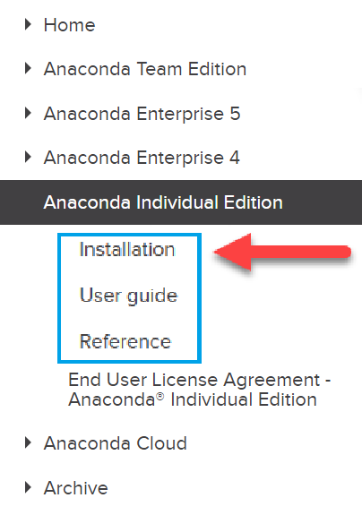
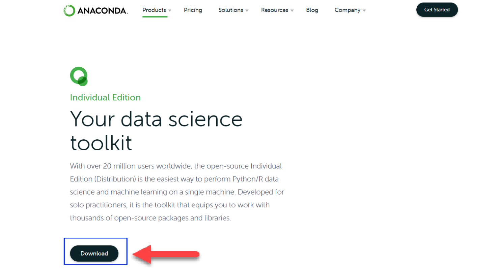
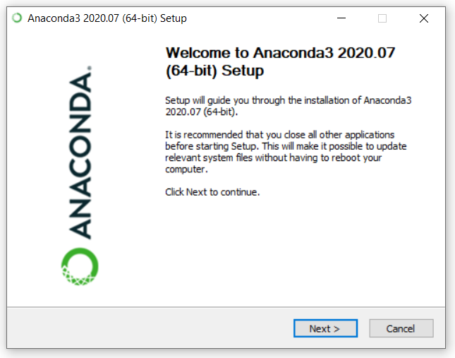
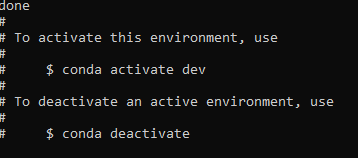

## Anaconda Environment Setup

This guide walks through the installation and configuration process for an Anaconda environment. This guide includes the following:

* Download and installation of Anaconda distribution for Python 3 

* Configuration of Anaconda dev virtual environment

* Activation of Anaconda dev environment

* Installation of JupyterLab

* **VERY IMPORTANT:** Anaconda downloads the Python 3.8 distribution by default, _however_ - **we will create and use a virtual environment that utilizes Python 3.7 instead**, as many of our activities are not yet compatible with the new Python 3.8 version. __It is imperative that you create the virtual environment as indicated and activate it prior to running your code.__

### Download and Install Anaconda

1. Navigate to the Anaconda installation [documentation](https://docs.anaconda.com/anaconda/install/). It will be valuable to have the documentation available in case any issues arise.

    

2. Navigate to the Anaconda download site, which can be found [here](https://www.anaconda.com/distribution/#windows). Click the `download` button as seen in the below image:

    

3. This will automatically move your screen to to the download section of the page.  Select the appropriate distribution for your system.

    


4. You will be asked to save the installer. Save it. After the download is complete, run the download file. This will launch an installation wizard that will walk you through the Anaconda install. Continue through the installation process by clicking either "I Agree" or "Next."

    

5. You will eventually get to a screen that asks if you would like to set your PATH environment variable using the installation wizard. Do NOT check this box. Make sure that both boxes are unchecked, as displayed in the below screenshot. Click `install`.

    

6. Click Finish once the installation is complete.

7. Next, open the terminal (Mac) or Git Bash (Windows).
  
    * Mac users can find the terminal by opening their Spotlight Search and typing `Terminal`.

    * Windows users can open Git Bash by locating it in their Start Menu:

    

8. Now we will enable the terminal commands. The instructions differ by your operating system.

* **Windows:** In your terminal, run the command `conda init bash`. Then close your terminal, and start a new one.

* **Mac:** If you're running an OS version earlier than 10.15 OR running version 10.15 with a `bash` terminal environment, type `conda init bash`. If you're running versions 10.15 (Catalina) or later AND running the `zsh` environment, type `conda init zsh`. Then close your terminal, and start a new one.

9. Execute the following commands to ensure the latest Anaconda packages are installed. When prompted, enter "y" to proceed.

    ```shell
    conda update conda
    conda update anaconda
    ```
      
10. Create a dev environment. When prompted, enter "y" to proceed.

    ```shell
    conda create -n dev python=3.7 anaconda
    ```

    

11. Activate the dev environment.

    ```shell
    conda activate dev
    ```

    

12. Verify your your installations by executing the `conda list` command after activating the environment, then locating the following packages in the populated list:

    - Numpy
    - Pandas
    - Matplotlib

13. **DON'T FORGET:** Anaconda downloads the Python 3.8 distribution by default, _however_ - many of our activities are not yet compatible with the new Python 3.8 version. __It is therefor imperative that you create the virtual environment as indicated using the _`python=3.7`_ parameter and activate it prior to running your code.__ The command to activate your virtual environment is `conda activate dev`.


