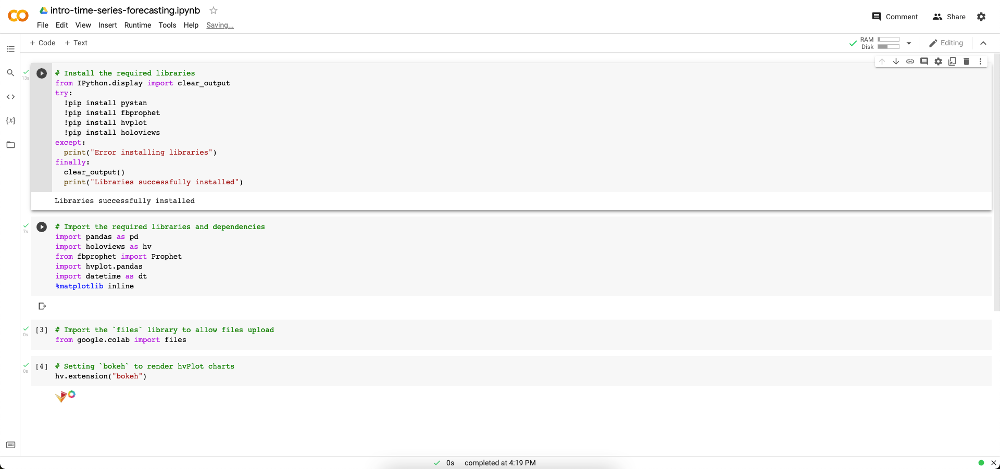

# Setting Up Google Colab

## Background

In this activity, you will get started with Google Colab and configure a notebook to use Prophet for time series forecasting.

**Hint:** You are encouraged to review the [Overview of Colaboratory Features](https://colab.research.google.com/notebooks/basic_features_overview.ipynb). This is a notebook created by Google as a quick start guide to Google Colab.

## Instructions

1. Open the [Google Colab URL](https://colab.research.google.com/) in your browser and create a new notebook.

2. Once the new notebook is created, configure your Google Colab workspace to include the libraries that we will use in today's class. Copy the following Python code in four different code cells, when you are done, execute all the cells.

   Code cell 1:

    ```python
    # Install the required libraries
    !pip install pystan
    !pip install fbprophet
    !pip install hvplot
    !pip install holoviews
    ```

   Code cell 2:

   ```python
   # Import the required libraries and dependencies
   import pandas as pd
   import holoviews as hv
   from fbprophet import Prophet
   import hvplot.pandas
   import datetime as dt
   %matplotlib inline
   ```

   Code cell 3:

   ```python
   # Import the files library to allow files upload
   from google.colab import files
   ```

   Code cell 4:

   ```python
   # Set `bokeh` to render hvPlot charts
   hv.extension("bokeh")
   ```

Once the Google Colab configuration is finished, you should have a notebook like the one shown in the following image:



---

© 2021 Trilogy Education Services, a 2U, Inc. brand. All Rights Reserved.
