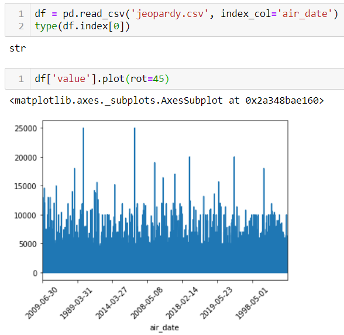
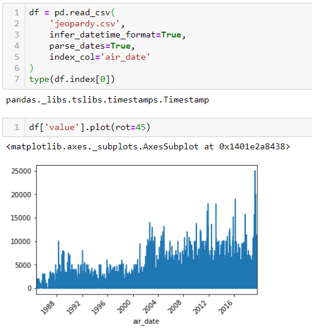
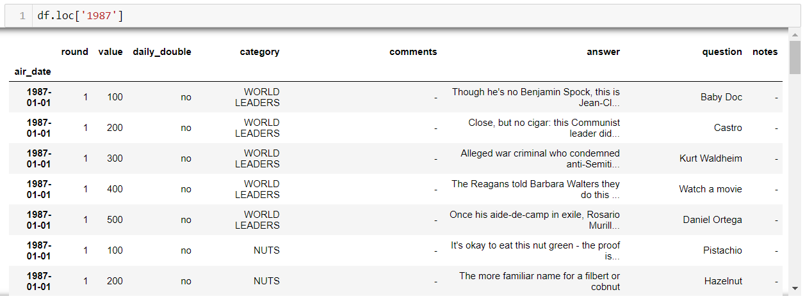
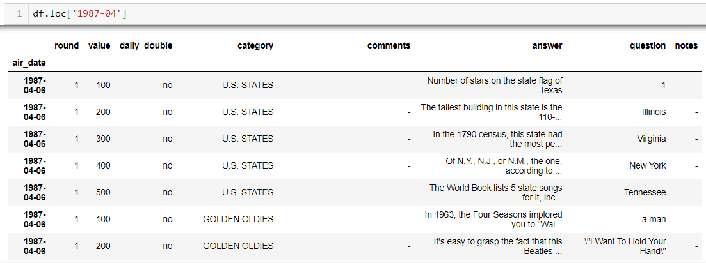
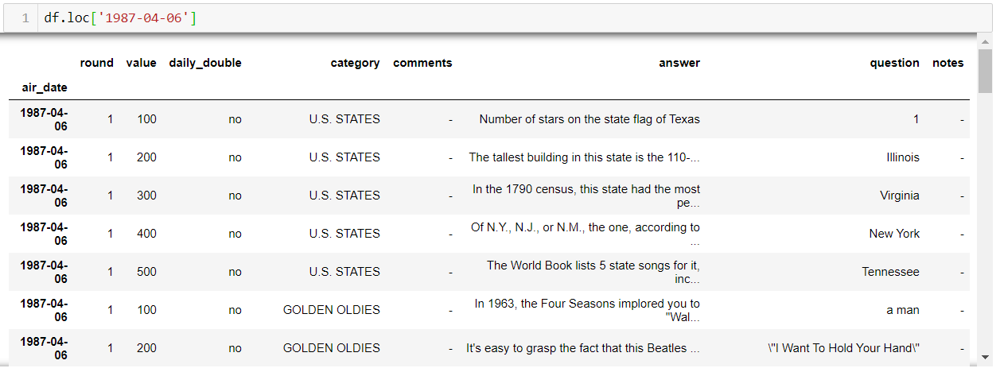
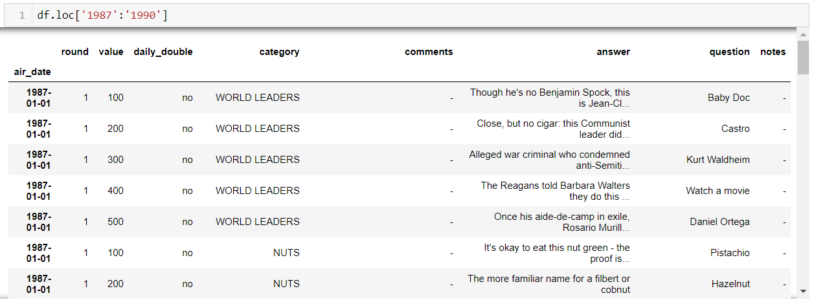
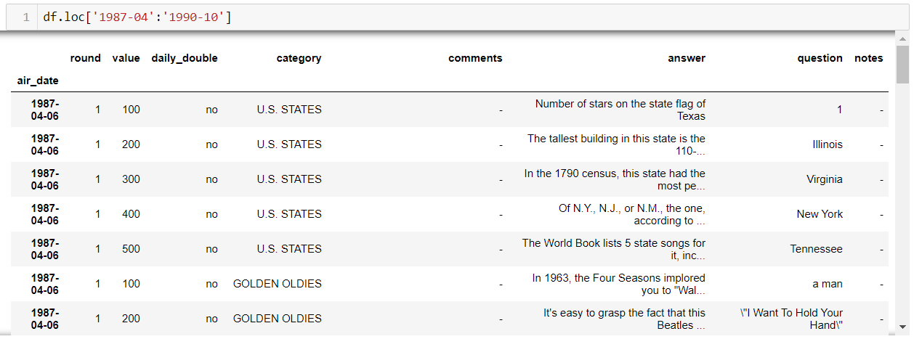
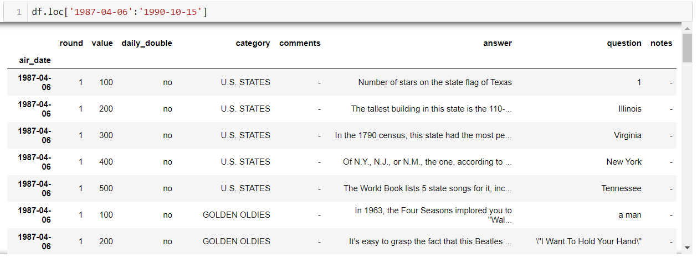
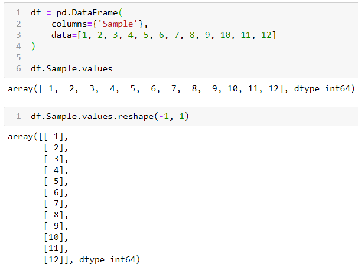

# Unit 10: Time Series

## FAQs

<details>
<summary>What's the point of using `datetime` objects?</summary>

Humans look dates and instantly know how to categorize them - day, month, year, etc. Your code look at dates see just another line of text, and will interpret that text as `strings`. This can make cleaning, prepping and plotting data very difficult. That's where time series functionality comes into play. Casting your date `strings` to `datetime` type translates them for your code, allowing the code to interpret and categorize dates the same way you do. For example, let's plot some Jeopardy data from the last 35 seasons. In the following example, the data is read in via `.read_csv()`, but the dates are read in as `strings` by default. You can see the dates are not categorized, but rather they are plotted in the order they appear in the data:

<br>

In the next example, the dates are parsed and converted to `datetime` objects. The dates are now being categorized properly and are listed in the correct order automatically:

<br>

</details>
<details><summary>How do you convert objects to `datetime`?</summary>
Converting objects to `datetime` can be tricky.  If using pandas, its best to handle the conversion upon reading in of data.  The syntax to handle the conversion from `read_csv()` is:

```python
df = pd.read_csv('jeopardy.csv', parse_dates=True)
```

This converts each object to a `datetime` object. Alternatively, you can also set the index as the date column for ease of plotting:

```python
df = pd.read_csv('jeopardy.csv', infer_datetime_format=True, parse_dates=True, index_col='air_date)
```

</details>
<details><summary>
How do you access `datetime` objects?</summary>

There are numerous ways to access `datetime` objects. One of the benefits of using these data types is the added functionality they provide for analyzing data, not just with plotting but with cleaning and aggregating. Using our Jeopardy example, we can access different episodes using different date calls:

<blockquote>
<details>
<summary>To access rows by a particular year:</summary>



</details>
<details>
<summary>To access rows by a particular year and month:</summary>



</details>

<details>
<summary>To access rows by a particular year, month, and day:</summary>



</details>
<details>
<summary>To access a range of dates by year:</summary>



</details>
<details>
<summary>To access a range of dates by year and month:</summary>



</details>
<details>
<summary>To access a range of dates by year, month and day:</summary>



</details>
</blockquote>

</details>

<details><summary>
How do you group time series data?</summary>
Grouping time series data is important for plotting and analysis.  The `.resample()` method allows grouping by multiple categories.  Similar to the `.groupby()` function, an aggregation method must be used to show the grouped data.  For example, we can group the mean Jeopardy point values by year using the following code:

<br>

The data can then be plotted:

<br>

The following is a non-exhaustive list of many `.resample()` frequency aliases:

| Alias        | Frequency Description             |
| ------------ | --------------------------------- |
| `D`          | Calendar day                      |
| `W`          | Weekly                            |
| `M`          | Month end                         |
| `SM`         | Semi-month end (15th & month end) |
| `BM`         | Business month end                |
| `MS`         | Month start                       |
| `SMS`        | Semi-month start (1st and 15th)   |
| `BMS`        | Business month start              |
| `Q`          | Quarter end                       |
| `BQ`         | Business quarter end              |
| `QS`         | Quarter start                     |
| `BQS`        | Business quarter start            |
| `A`          | Year end                          |
| `BA`, `BY`   | Business year end                 |
| `AS`, `YS`   | Year start                        |
| `BAS`, `BYS` | Business year start               |
| `BH`         | Business hour                     |
| `H`          | Hourly                            |
| `T`, `min`   | Minutes                           |
| `S`          | Seconds                           |
| `L`, `ms`    | Milliseconds                      |
| `U`, `us`    | Microseconds                      |
| `N`          | Nanoseconds                       |

</details>

<details><summary>
What is .reshape() and why do I have to use it?</summary>

When working with Pandas, we often pass Series objects into our model. The shape of values in a Pandas Series object is a 1d array. This has to be converted into a 2d array which is essentially an array of arrays - or list of lists. . This is done using the `.reshape()` function. The matrix values we desire are passed into this function. In the following example we reshape our list into a 2d array using `.reshape(3,4)`, where 3 is the number of lists and 4 is the number of values in each list:


Many models require the 2d array to be formatted such that each value is in a list by itself. If we were inserting the above sample data into a model, it would be converted using `.reshape(-1,1)`, where -1 indicates an unknown number of rows, and 1 indicates the number of values in each list. The -1 will allow the function to generate the amount of rows necessary to hold the data. The output looks like this:



</details>

---

© 2020 Trilogy Education Services, a 2U, Inc. brand. All Rights Reserved.
